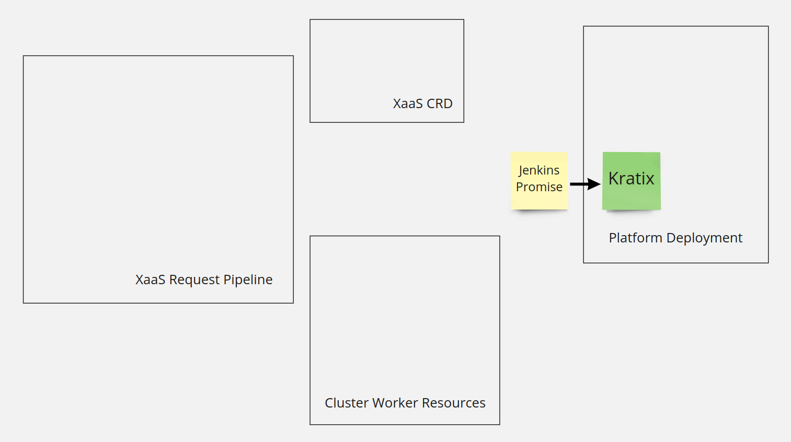
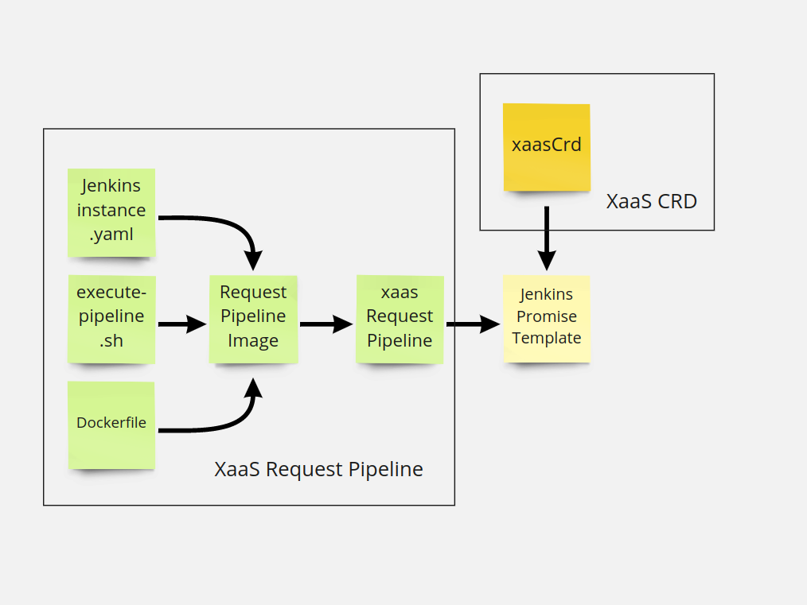
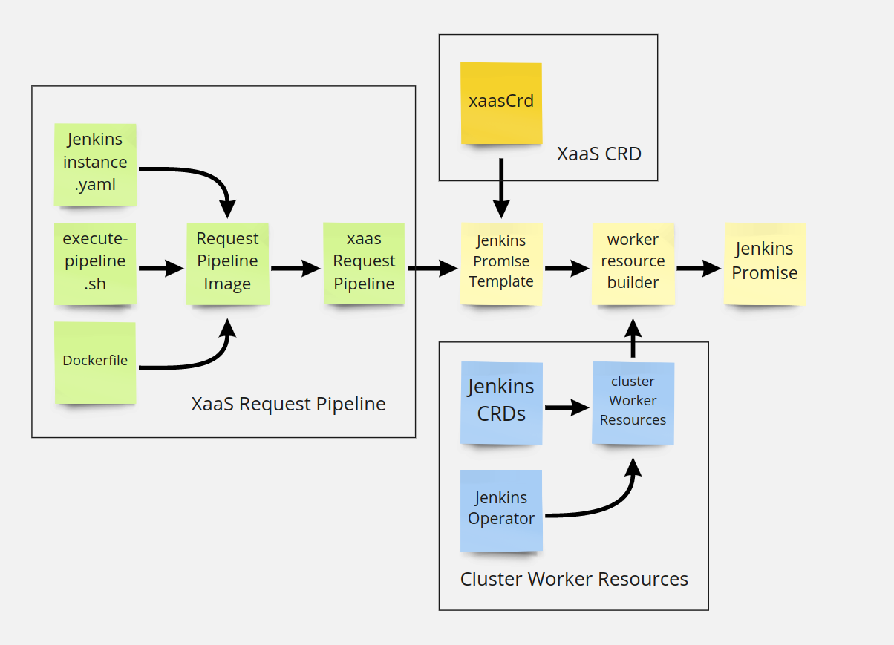

# Writing your own promise
 
- [Writing your own promise](#writing-your-own-promise)
  - [What's the Problem?](#whats-the-problem)
  - [What's the Solution?](#whats-the-solution)
  - [What will I learn?](#what-will-i-learn)
  - [Writing a Promise](#writing-a-promise)
    - [Prerequisites:](#prerequisites)
    - [Promise basics](#promise-basics)
    - [Promise template](#promise-template)
    - [X-as-a-Service Custom Resource Definition](#x-as-a-service-custom-resource-definition)
    - [X-as-a-Service Request Pipeline](#x-as-a-service-request-pipeline)
    - [Cluster Worker Resources](#cluster-worker-resources)
    - [Create and submit a resource request](#create-and-submit-a-resource-request)
  - [Summary](#summary)
  - [Where Next?](#where-next)

## What's the Problem? 
Syntasso understands being a Platform team member is challenging. These teams relentlessly feel tensions from many directions, and often face: 
* Demands from their customers, who increasingly expect software served from internal platforms be as simple, quick to consume, and performant as commodity public-cloud services.
* Huge learning curves as they take software from large vendors, figure out how to tweak the seemingly endless configuration options to introduce the "right" level of opinions: not too opinionated to reduce utility for their users, but opinionated enough to meet their own internal SLI/SLO requirements.
* Demands from their own internal security, audit, and compliance teams who expect all internal software to be secure, traceable, up-to-date, and compliant with industry regulations.

## What's the Solution? 
This is where Promises can help. The aim of a Promise is simple: 
* To enable Platform teams to take complex software, modify the settings needed to meet their internal requirements, inject their own organisational opinions, and finally to expose a simplified API to _their_ users to enable frictionless creation and consumption of services that meet the needs of all stakeholders.  
   
The more Promises a platform can deliver, the richer that platform becomes, and while commercial entities will provide high-quality Promises that meet the demands of a broad base of platform teams, it is inevitable teams in organisations at scale will have to respond to requests to add further custom as-a-Service capabilities. 

## What will I learn?
We will walk through the steps needed to create your own Promise, configure it for your needs, decorate it with your own opinions, and expose it as-a-Service ready for consumption by your platform users. 

You will learn how to:
* Build a Promise for complex software, and expose it via a simple custom API which captures the data needed from users to configure the Promise for consumption "as-a-Service".
* Wrap, and deploy the underlying Kubernetes CRDs, Operators, and resources required to run your Promise. 
* Create a Promise pipeline to inject captured user-data into the underlying Kubernetes resources, and decorate the Promised software with custom behavior so the running Promise reflects your your organisational, and users' requirements.

## Writing a Promise


### Prerequisites:
1. [Install Kratix across 2 Kind clusters](../README.md)
2. Install Kubernetes-in-Docker(KinD). See [the quick start guide](https://kind.sigs.k8s.io/docs/user/quick-start/). Tested on 0.9.0 and 0.10.0.
    - Ensure no KinD clusters are currently running. `kind get clusters` should return "No kind clusters found."
3. Install Kubectl. See [the install guide](https://kubernetes.io/docs/tasks tools/#kubectl). Tested on 1.16.13 and 1.21.2.
4. A Docker Hub account with push permissions (or similar registry).
5. [The Docker cli](https://docs.docker.com/get-docker/) -- to build and push images.    

To begin writing a Promise we will need a basic directory structure to work in.

 ```
mkdir -p jenkins-promise/{resources,request-pipeline-image}
cd jenkins-promise
``` 

### Promise basics
Conceptually a Promise is Broken down into three parts:

1. `xaasCrd`: this is the CRD that is exposed to the users of the Promise. Imagine the order form for a product. What do you need to know from your customer? Size? Location? Name?
2. `xaasRequestPipeline`: this is the pipeline that will create the Jenkins resources requried to run Jenkins on a worker cluster decorated with whatever you need to run Jenkins from your own Platform. Do you need to scan images? Do you need to send a request to an external API for approval? Do you need to inject resources for storage, mesh, networking, etc.? These activities happen in the pipeline.
3. `clusterWorkerResources`: this contains all of the Kuberentes resources required on a cluster for it to be able to run an instance Jenkins such as CRDs, Operators and Deployments. Think about the required prerequisites necessary on the worker cluster, so that the resources declared by your pipeline are able to converge.



### Promise template

Create a basic `jenkins-promise-template.yaml` to work with:

```bash
cat > jenkins-promise-template.yaml <EOF
apiVersion: platform.kratix.io/v1alpha1
kind: Promise
metadata:
  name: jenkins-promise
spec:
  #injected via: go run path/to/kratix/hack/worker-resource-builder/main.go -k8s-resources-directory ${PWD}/resources -promise ${PWD}/jenkins-promise-template.yaml > jenkins-promise.yaml
  #clusterWorkerResources: 
  xaasRequestPipeline:
  xaasCrd:
EOF
```

We will fill the `spec` scalars as we progress through the tutorial.

### X-as-a-Service Custom Resource Definition 
This is the user-facing API. For the purpose of this tutorial we will create an API that accepts a single `string` parameter called `name`. This API can be as complex or as simple as you need it to be for your own needs.


Add the below to the `xaasCrd` scalar in `jenkins-promise-template.yaml`. Ensure the indentation is correct (`xaasCrd` is nested under `spec`).

```yaml
  xaasCrd:
    apiVersion: apiextensions.k8s.io/v1
    kind: CustomResourceDefinition
    metadata:
    name:  jenkins.promise.example.com
    spec:
    group: promise.example.com
    scope: Namespaced
    names:
      plural: jenkins
      singular: jenkins
      kind: jenkins
    versions:
      - name: v1
        served: true
        storage: true
        schema:
          openAPIV3Schema:
            type: object
            properties:
              spec:
                type: object
                properties:
                  name:
                    type: string
```

We have now created our as-a-Service API.

### X-as-a-Service Request Pipeline
Next we will build the pipeline required to transform a Promise request into the Kubnernetes resources required to create a running instance of the Promised service.

The `xaasRequestPipeline` is an array of container images that execute in a defined order. Each Docker image can take on a single responsibility required for the creation of the service. We will create a step that takes the `name` parameter -- as defined in the previous tutorial stage -- and pass it into the Jenkins Custom resource. 

The contract with each container is simple and straightforward.
- The first container in the list receives the resource created by the user when they applied their request. This document, by definition, will be a valid Kubernetes resource as defined by the `xaasCrd`. The document will be available in /input/object.yaml
- The container's command then executes, using the input object, and fulfilling any responsibilites necessary.
- The container writes any resources to be created to /output/.
- The resources in /output of the last container in the `xaasRequestPipeline` array will be scheduled and applied to the appropriate worker clusters.

In more advanced Promises, each of these 'stages' will take on responsibilities such as vulnerability scanning, licence checking, and secure certificate injection; the possibilities are endless. Look out for partnerships in this space to provide integrations for common services and tooling.



`cd request-pipeline-image`

Create the <code>jenkins-instance.yaml</code> by running the below command.
<details>
<summary><b>Note:</b> the code is folded for brevity</summary>

```bash
cat > jenkins-instance.yaml <EOF
apiVersion: jenkins.io/v1alpha2
kind: Jenkins
metadata:
  name: <tbr-name>
  namespace: default
spec:
  configurationAsCode:
    configurations: []
    secret:
      name: ""
  groovyScripts:
    configurations: []
    secret:
      name: ""
  jenkinsAPISettings:
    authorizationStrategy: createUser
  master:
    disableCSRFProtection: false
    containers:
      - name: jenkins-master
        image: jenkins/jenkins:2.277.4-lts-alpine
        imagePullPolicy: Always
        livenessProbe:
          failureThreshold: 12
          httpGet:
            path: /login
            port: http
            scheme: HTTP
          initialDelaySeconds: 100
          periodSeconds: 10
          successThreshold: 1
          timeoutSeconds: 5
        readinessProbe:
          failureThreshold: 10
          httpGet:
            path: /login
            port: http
            scheme: HTTP
          initialDelaySeconds: 80
          periodSeconds: 10
          successThreshold: 1
          timeoutSeconds: 1
        resources:
          limits:
            cpu: 1500m
            memory: 3Gi
          requests:
            cpu: "1"
            memory: 500Mi
  seedJobs:
    - id: jenkins-operator
      targets: "cicd/jobs/*.jenkins"
      description: "Jenkins Operator repository"
      repositoryBranch: master
      repositoryUrl: https://github.com/jenkinsci/kubernetes-operator.git
EOF
```
</details>
<p>

Kratix takes no opinion on the tooling used within a pipeline. Kratix will pass in a set of resources the pipeline, and expect back a set of resources. What happens withing the pipeline, and what tooling is used, is entirely a decision left to the promise author. As our pipeline is very simple (we're taking a name from the Promise custom resource input, and passing it to the Jenkins custom resource output) we're going to keep-it-simple and use a combination of `sed` and `yq` todo our work. 

```bash
cat > execute-pipeline.sh <EOF
#!/bin/sh 
#Get the name from the Promise Custom resource
instanceName=\$(yq eval '.spec.name' /input/object.yaml) ; \

# Inject the name into the Jenkins resources
find /tmp/transfer -type f -exec sed -i \\
  -e "s/<tbr-name>/\${instanceName//\//\\/}/g" \\
  {} \;  

cp /tmp/transfer/* /output/
EOF
```
Then make it executable:

```bash
chmod +x execute-pipeline.sh
```

Next, we create a simple `Dockerfile` that will copy our `jenkins-instance.yaml` doc into Kratix where it can be amended by our `execute-pipeline.sh` script and passed to the Worker cluster ready for execution.

```bash
cat > Dockerfile <EOF
FROM "mikefarah/yq:4"
RUN [ "mkdir", "/tmp/transfer" ]

ADD jenkins-instance.yaml /tmp/transfer/jenkins-instance.yaml
ADD execute-pipeline.sh execute-pipeline.sh

CMD [ "sh", "-c", "./execute-pipeline.sh"]
ENTRYPOINT []
EOF
```

Next you will need to run
```bash
docker build . --tag <your-org-name/name-of-your-image>
```

We can test our container image by supplying an input resource and examining the output resource.

Let's create the test input and output directories locally.

```bash
mkdir {input,output}
```

We need a sample user request:

```bash
cat > input/object.yaml <EOF
apiVersion: promise.example.com/v1
kind: jenkins
metadata:
  name: my-jenkins-promise-request
spec:
  name: my-amazing-jenkins
EOF
```

Now we can run our container and examine the output.

```bash
docker run -v ${PWD}/input:/input -v ${PWD}/output:/output <your-org-name/name-of-your-image>
cat output/*
```

*If we already have the "Cluster Worker Resources" (see beneath) installed on a test cluster, we can optionally apply the resources in the /output directory and test to see if the Jenkins instance is created.*

Once we are satisified with the image, we can push it so it's ready for use in our pipeline.
```bash
docker push <your-org-name/name-of-your-image>
```

The final step of creating the `xaasRequestPipeline` is to add the  `spec.xaasRequestPipeline` scalar in `jenkins-promise-template.yaml` making sure you add the correct image details.

Let's move back to our "jenkins-promise" directory.

```bash
cd ..
```

And add the image to the array in `jenkins-promise-template.yaml`.

```yaml
xaasRequestPipeline:
    - <your-org-name/name-of-your-image>
```

XaasRequestPipeline Summary

We have:
- Created a container image containing:
    - A template file to be injected with per-instance details (jenkins-instance.yaml)
    - A shell script to retrieve the per-instance details from the user's request, and inject them into the template (execute-pipeline.sh)
    - A command set to the shell script
- Created a set of directories(input/output) and sample user request(input/object.yaml)
- Executed our pipeline image locally as a test
- Pushed our image to our registry
- Added the image to our Promise definition in the `xaasRequestPipeline` array

*Please note: at time of writing, only the first image in the `xaasRequestPipeline` array will be executed. Multiple image functionality will be available soon.*


### Cluster Worker Resources



 Jenkins.io has a [great Operator](https://jenkinsci.github.io/kubernetes-operator/docs/getting-started/latest/installing-the-operator/) that ships in two files.
1. [Jenkins CRDs](https://raw.githubusercontent.com/jenkinsci/kubernetes-operator/master/config/crd/bases/jenkins.io_jenkins.yaml)
2. [The Operator](https://raw.githubusercontent.com/jenkinsci/kubernetes-operator/master/deploy/all-in-one-v1alpha2.yaml) and other required resources such as Service Accounts, Role Bindings and Deployments.

We will need to download both.
* `wget https://raw.githubusercontent.com/jenkinsci/kubernetes-operator/master/config/crd/bases/jenkins.io_jenkins.yaml -P resources`
* `wget https://raw.githubusercontent.com/jenkinsci/kubernetes-operator/master/deploy/all-in-one-v1alpha2.yaml -P resources`  

Next we need to inject Jenkins files into our `jenkins-promise-template.yaml`. To make this step simpler we have written a _very basic_ tool to grab all YAML documents from all YAML files located in `resources` and inject them into the `clusterWorkerResources` scalar. 

`path/to/kratix/hack/worker-resource-builder/worker-resource-builder -k8s-resources-directory ${PWD}/resources -promise ${PWD}/jenkins-promise-template.yaml > jenkins-promise.yaml`

This will create the finished `jenkins-promise.yaml` which can now be applied to the Kratix platform cluster:

`kubectl apply --context kind-platform -f jenkins-promise.yaml` 

after a few seconds we can run `kubectl --context kind-platform get crds` and we should see something like:
```bash
NAME                          CREATED AT
jenkins.promise.example.com   2021-09-09T11:21:10Z
```

The complexities of what happens when installing a Promise are beyond this tutorial, but for now it's good to understand that a k8s Controller is now responding to Jenkins resource requests on the platform cluster. 

After a few minutes we can go to the Worker cluster and see we have a Jenkins operator running. 

`kubectl --context=kind-worker get pods -A`

See a Jenkins Operator.

### Create and submit a resource request


Next, we change hats from Platform team member and become the customer of the Platform team. We should now be able to request instances of Jenkins on-demand.

```bash
cat > jenkins-resource-request.yaml <EOF
apiVersion: promise.example.com/v1
kind: jenkins
metadata:
  name: my-jenkins-promise-request
spec:
  name: my-amazing-jenkins
EOF

kubectl apply --context kind-platform -f jenkins-resource-request.yaml
```

After a few minutes the Jenkins operator will have received the request and asked the k8s worker to start an instance of Jenkins. We can target the Worker cluster (`kubectl config use-context kind-worker`) and run `kubectl get pods -A` to see our Jenkins instance with the defined name of `jenkins-my-amazing-jenkins`! (The Jenkins operator prepends the instance name with `jenkins-` hence `jenkins-my-amazing-jenkins`)

We can see the Jenkins UI in our browsers (all commands on worker cluster):
1. Get the username: `kubectl get secret jenkins-operator-credentials-my-amazing-jenkins -o 'jsonpath={.data.user}' | base64 -d`
2. Get the password: `kubectl get secret jenkins-operator-credentials-my-amazing-jenkins -o 'jsonpath={.data.password}' | base64 -d`
3. `kubectl port-forward jenkins-my-amazing-jenkins 8080:8080` 
4. Navigate to http://localhost:8080

## Summary

We built a Jenkins-as-a-Service offering, by creating a Jenkins Promise, and adding the Promise to our Kratix-based platform.

We created the three elements of a Promise for Jenkins:
- `xaasCrd`
- `xaasRequestPipeline`
- `clusterWorkerResources`
                                         
and added them to our single Jenkins Promise yaml document. We then applied our Jenkins Promise to our platform cluster, which created the Jenkins-as-a-Service API, and configured our worker cluster such that it could create and manage Jenkins instances. Lastly, we assumed the role of our customer, and applied a yaml document to our platform cluster, triggering the creation of a Jenkins instance on the worker cluster.

## Where Next?

Create your own Promises for your the customers of your platform. Where they may be of use to others, share them! Public repository information will be available in the future.
